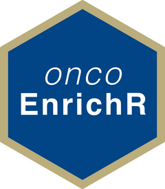
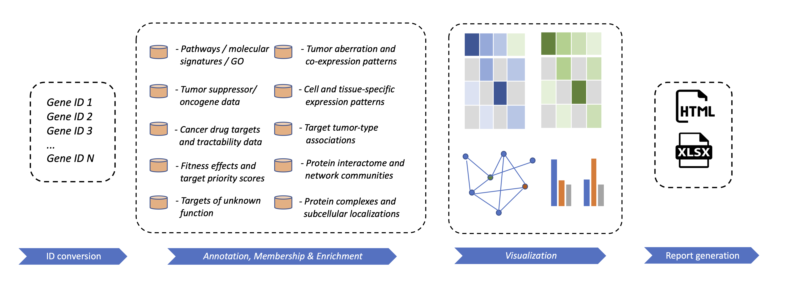

# oncoEnrichR 

**oncoEnrichR** is an R package for functional interrogation of human gene lists in the context of cancer. The package leverages an extensive amount of prior molecular knowledge that allows for biological interpretation along multiple dimensions, both at the systems level and at the level of individual genes.

Web-based access to **oncoEnrichR** is available at [**https://oncotools.elixir.no**](https://oncotools.elixir.no/tool_runner?tool_id=galaxy-ntnu.bioinfo.no%2Ftoolshed_nels%2Frepos%2Fradmilko%2Foncoenrichr%2Foncoenrichr_wrapper%2F1.3.0)

**oncoEnrichR** is primarily intended for exploratory analysis and prioritization of a gene list (referred to here as **query set**) from high-throughput cancer biology experiments, e.g. CRISPR screens, protein proximity labeling, or gene expression profiling. The tool queries a number of high-quality data resources in order to assemble cancer-relevant annotations and analyses in an interactive report.

 

## Getting started

-   [What types of questions can be answered by oncoEnrichR?](https://sigven.github.io/oncoEnrichR/index.html#questions-adressed-by-oncoenrichr)
-   [Output views from oncoEnrichR](https://sigven.github.io/oncoEnrichR/articles/output.html)
-   [Installation instructions](https://sigven.github.io/oncoEnrichR/articles/installation.html)
-   [Running instructions](https://sigven.github.io/oncoEnrichR/articles/running.html)
-   [Annotation resources available in oncoEnrichR](https://sigven.github.io/oncoEnrichR/articles/annotation_resources.html)

## News

-   September 12th 2022: [**1.3.0 release**](https://sigven.github.io/oncoEnrichR/articles/CHANGELOG.html#version-1-3-0)
-   September 2nd 2022: [**1.2.2 release**](https://sigven.github.io/oncoEnrichR/articles/CHANGELOG.html#version-1-2-2)
-   July 13th 2022: [**1.2.1 release**](https://sigven.github.io/oncoEnrichR/articles/CHANGELOG.html#version-1-2-1)

## Example report

### Contact

sigven AT ifi.uio.no

### Funding and Collaboration

OncoEnrichR is supported by the [Centre for Cancer Cell Reprogramming](https://www.med.uio.no/cancell/english/) at the [University of Oslo](https://www.uio.no)/[Oslo University Hospital](https://radium.no), and [Elixir Norway (Oslo node)](https://elixir.no/organization/organisation/elixir-uio).

   

  
  &nbsp;&nbsp;&nbsp;&nbsp;&nbsp;&nbsp;&nbsp;
  

