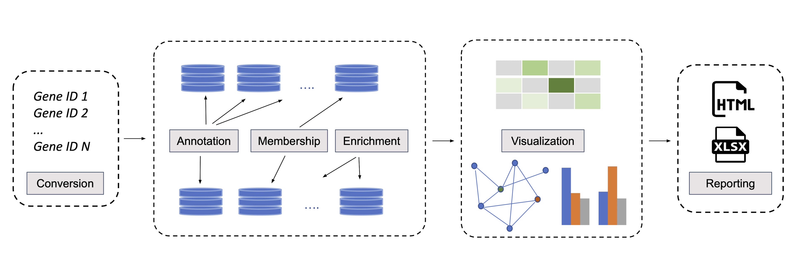

## oncoEnrichR - cancer-dedicated gene set interpretation

### Contents

-   [Overview](#overview)
-   [News](#news)
-   [Annotation resources](#annotation-resources)
-   [Example report](#example-report)
-   [Getting started](#getting-started)
-   [Citation](#citation)
-   [Contact](#contact)
-   [Funding and Collaboration](#funding-and-collaboration)
-   [Code of Conduct](#code-of-conduct)

### Overview

**oncoEnrichR** is an R package for functional interrogation of human genesets in the context of cancer. The package leverages an extensive amount of prior molecular knowledge for geneset interpretation along multiple dimensions.

Web-based access to **oncoEnrichR** is available at <https://oncotools.elixir.no>

**oncoEnrichR** is primarily intended for exploratory analysis and prioritization of a gene list (referred to here as **query set**) from high-throughput cancer biology experiments, e.g. genetic screens (siRNA/CRISPR), protein proximity labeling, or transcriptomics (differential expression). The tool queries a number of high-quality data resources in order to assemble useful gene annotations and analyses in an interactive report (examples from the report shown below).

<br>



<br><br>

The contents of the final report attempt to provide answers to the following questions:

-   Which diseases/tumor types are known to be associated with genes in the query set, and to what extent?
-   Which genes in the query set are attributed with cancer hallmark evidence?
-   Which proteins in the query sets are druggable in diffferent cancer conditions (early and late clinical development phases)? For other proteins in the query set, what is their likelihood of being druggable?
-   Which protein complexes involve proteins in the query set?
-   Which subcellular compartments (nucleus, cytosol, plasma membrane etc) are dominant localizations for proteins in the query set?
-   Are specific tissues or cell types enriched in the query set, considering tissue/cell-type specific expression patterns of target genes?
-   Which protein-protein interactions are known within the query set? Are there interactions between members of the query set and other cancer-relevant proteins (e.g. proto-oncogenes, tumor-suppressors or predicted cancer drivers)? Which proteins constitute hubs in the protein-protein interaction network?
-   Which known regulatory interactions (TF-target) are found within the query set, and what is their mode of regulation (repressive vs. stimulating)?
-   Are there occurrences of known ligand-receptor interactions within the query set?
-   Are there specific pathways, biological processes, or pre-defined molecular signatures that are enriched within the query set, as compared to a reference/background set?
-   Which members of the query set are frequently mutated in tumor sample cohorts (TCGA, SNVs/InDels, homozygous deletions, copy number amplifications)?
-   Which members of the query set are co-expressed (strong negative or positive correlations) with cancer-relevant genes (i.e. proto-oncogenes or tumor suppressors) in tumor sample cohorts (TCGA)?
-   Which members of the query set are associated with better/worse survival in different cancers, considering high or low gene expression levels, mutation, or copy number status in tumors?
-   Which members of the query set are associated with cellular loss-of-fitness in CRISPR/Cas9 whole-genome drop out screens of cancer cell lines (i.e. reduction of cell viability elicited by a gene inactivation)? Which targets are prioritized therapeutic targets, considering fitness effects and genomic biomarkers in combination?

### News

-   October 27th 2021: **1.0.6 release**

    -   Addition of new modules
        -   Regulatory interactions - DoRothEA
        -   Ligand-receptor interactions - CellChatDB
    -   Data updates: Open Targets Platform, KEGG, WikiPathways, CancerMine, TCGA, EFO, DiseaseOntology
    -   Additional dedicated enrichment plots (GO)
    -   Improved target rankings (tissue- and celltype enrichment, regulatory interactions)
    -   See complete [CHANGELOG](https://sigven.github.io/oncoEnrichR/news/index.html)

-   July 8th 2021: **1.0.4 release**

    -   Fixed a bug in v1.0.3 - HTML report generation failed

-   June 29th 2021: **1.0.3 release**

    -   Minor typo fixes in HTML output
    -   Data upgrade: KEGG, WikiPathways, CancerMine
    -   **NEW**: web interface to oncoEnrichR: [oncotools.elixir.no](https://oncotools.elixir.no)

-   June 8th 2021: **1.0.0 release**

    -   Added methylation as prognostic feature from [Smith et al., *bioRxiv*, 2021](https://www.biorxiv.org/content/10.1101/2021.06.01.446243v1)
    -   To keep the size of output Excel/HTML files at managable levels, maximum size of queryset is reduced to **n = 600 genes**
    -   Fixed assymetrical scales of prognostic Z-score plots

### Annotation resources

Data harvested from the following resources form the backbone of *oncoEnrichR*:

-   [Open Targets Platform](https://targetvalidation.org) - human drug-target associations and comprehensive disease-target associations
-   [CancerMine](http://bionlp.bcgsc.ca/cancermine/) - literature-mined database of drivers, oncogenes and tumor suppressors in cancer
-   [DoRothEA](https://saezlab.github.io/dorothea/index.html) - gene set resource containing signed transcription factor (TF) - target (regulatory) interactions
-   [CellChatDB](http://www.cellchat.org/) - ligand-receptor interaction resource
-   [The Cancer Genome Atlas (TCGA)](https://portal.gdc.cancer.gov/) - gene aberration frequencies and co-expression patterns in \~9,500 primary tumor samples
-   [The Human Protein Atlas](https://www.proteinatlas.org) - expression data for healthy human tissues ([GTex](https://gtexportal.org/home/))/cell types, and prognostic gene expression associations in cancer
-   [Molecular Signatures Database (MSigDB)](http://software.broadinstitute.org/gsea/msigdb/index.jsp) - collection of annotated (e.g. towards pathways) genesets for enrichment/overrepresentation analysis. This includes genesets from [Gene Ontology](http://geneontology.org/), [Reactome](https://reactome.org/), [KEGG](https://www.genome.jp/kegg/pathway.html), [WikiPathways](https://www.wikipathways.org/index.php/WikiPathways), [BIOCARTA](https://maayanlab.cloud/Harmonizome/dataset/Biocarta+Pathways), as well as curated [immunologic](https://www.gsea-msigdb.org/gsea/msigdb/collections.jsp#C7) and [cancer-specific](https://www.gsea-msigdb.org/gsea/msigdb/collections.jsp#C6) signatures.
-   [NetPath](http://www.netpath.org) - signaling transduction pathways
-   [STRING](https://string-db.org) - protein-protein interaction database
-   [CORUM](https://mips.helmholtz-muenchen.de/corum/) - protein complex database
-   [Compleat](https://fgr.hms.harvard.edu/compleat%3E) - protein complex resource
-   [ComplexPortal](https://www.ebi.ac.uk/complexportal/home) - manually curated, encyclopaedic resource of macromolecular complexes
-   [hu.MAP2](http://humap2.proteincomplexes.org) - human protein complex map
-   [ComPPI](http://comppi.linkgroup.hu/) - subcellular compartment database
-   [Project Score](https://score.depmap.sanger.ac.uk) - Database on the effects on cancer cell line viability elicited by CRISPR-Cas9 mediated gene activation
-   [Genetic determinants of survival in cancer](http://survival.cshl.edu/) - Resource on the relative prognostic impact of gene mutation, expression, methylation, and CNA in human cancers

### Example report

<a href="https://doi.org/10.5281/zenodo.5602807"></a>

<br>


### Getting started

#### Installation

##### Latest release

1.  `install.packages('devtools')`
2.  `devtools::install_github('sigven/oncoEnrichR', ref = "v1.0.6")`
3.  `library(oncoEnrichR)`

##### Development version

1.  `install.packages('devtools')`
2.  `devtools::install_github('sigven/oncoEnrichR')`
3.  `library(oncoEnrichR)`


[](http://github.com/badges/stability-badges)

#### Usage

*oncoEnrichR* performs its operations through the following procedures/methods:

**1.** `oncoEnrichR::onco_enrich()`

-   Consists of two main processing steps:

    1\) Takes an input/query list of human gene/protein identifiers (e.g. UniProt accession, RefSeq/Ensembl transcript identifer etc.) as input and conducts uniform identifier conversion

    2\) Performs extensive annotation, enrichment and membership analyses of the query set against underlying data sources on cancer-relevant properties of human genes and their interrelationships.

-   Technically, the method returns a *list object* with all contents of the analyses performed. The specific arguments/options and default values are outlined below:

    ``` r
    onco_enrich(
      query,
      query_id_type = "symbol",
      ignore_id_err = TRUE,
      html_floating_toc = TRUE,
      html_report_theme = "default",
      project_title = "Project title",
      project_owner = "Project owner",
      project_description = "Project description",
      bgset = NULL,
      bgset_id_type = "symbol",
      bgset_description = "All protein-coding genes",
      p_value_cutoff_enrichment = 0.05,
      p_value_adjustment_method = "BH",
      q_value_cutoff_enrichment = 0.2,
      min_geneset_size = 10,
      max_geneset_size = 500,
      num_terms_enrichment_plot = 20,
      min_subcellcomp_confidence = 1,
      subcellcomp_show_cytosol = FALSE,
      min_confidence_reg_interaction = "D",
      simplify_go = F,
      show_ppi = T,
      show_drugs_in_ppi = T,
      show_disease = T,
      show_top_diseases_only = T,
      show_cancer_hallmarks = T,
      show_drug = T,
      show_enrichment = T,
      show_tcga_aberration = T,
      show_tcga_coexpression = T,
      show_subcell_comp = T,
      show_crispr_lof = T,
      show_cell_tissue = F,
      show_ligand_receptor = T,
      show_regulatory_interactions = T,
      show_unknown_function = T,
      show_prognostic_cancer_assoc = T,
      show_complex = T)
    ```

    See [detailed descriptions of all options here](https://sigven.github.io/oncoEnrichR/reference/onco_enrich.html)

**2.** `oncoEnrichR::write()`

-   Consists of two main processing steps:

    1\) Transform the contents of the analyses returned by *oncoEnrichR::onco_enrich()* into various visualizations and interactive tables

    2\) Assemble and write the final analysis report through

    -   A\) a structured and interactive *oncoEnrichR* HTML report, OR
    -   B\) a multisheet Excel workbook with results from the annotations and analyses provided by *oncoEnrichR*

#### Example run

A target list of *n = 134* high-confidence interacting proteins with the c-MYC oncoprotein were previously identified through BioID protein proximity assay in standard cell culture and in tumor xenografts ([Dingar et al., J Proteomics, 2015](https://www.ncbi.nlm.nih.gov/pubmed/25452129)). We ran this target list through the *oncoEnrichR* analysis workflow using the following configurations for the `onco_enrich` method:

-   `project_title = "cMYC_BioID_screen"`
-   `project_owner = "Raught et al."`

and produced the [following HTML report with results](https://doi.org/10.5281/zenodo.5602807).

Below are R commands provided to reproduce the example output. **NOTE**: Replace "LOCAL_FOLDER" with a directory on your local computer:

-   `library(oncoEnrichR)`
-   `myc_interact_targets <- read.csv(system.file("extdata","myc_data.csv", package = "oncoEnrichR"), stringsAsFactors = F)`
-   `myc_report <- oncoEnrichR::onco_enrich(query = myc_interact_targets$symbol, show_cell_tissue = T, project_title = "cMYC_BioID_screen", project_owner = "Raught et al.")`
-   `oncoEnrichR::write(report = myc_report, file = "LOCAL_FOLDER/myc_report_oncoenrichr.html", format = "html")`
-   `oncoEnrichR::write(report = myc_report, file = "LOCAL_FOLDER/myc_report_oncoenrichr.xlsx", format = "excel")`

### Citation

If you use oncoEnrichR, please cite the following preprint:

<https://arxiv.org/abs/2107.13247>

### Contact

sigven AT ifi.uio.no

### Funding and Collaboration

OncoEnrichR is supported by the [Centre for Cancer Cell Reprogramming](https://www.med.uio.no/cancell/english/) at the [University of Oslo](https://www.uio.no)/[Oslo University Hospital](https://radium.no), and [Elixir Norway (Oslo node)](https://elixir.no/organization/organisation/elixir-uio).

<br> <br>

<p float="left">
  <a href="https://www.med.uio.no/cancell/english/">
     
  </a>
  &nbsp;&nbsp;&nbsp;&nbsp;&nbsp;&nbsp;&nbsp;
  <a href="https://elixir.no/organization/organisation/elixir-uio">
     
  </a>
</p>

### Code of Conduct

Please note that this project is released with a [Contributor Code of Conduct](https://github.com/sigven/oncoEnrichR/blob/master/
.github/CODE_OF_CONDUCT.md). By participating in this project you agree to abide by its terms.
