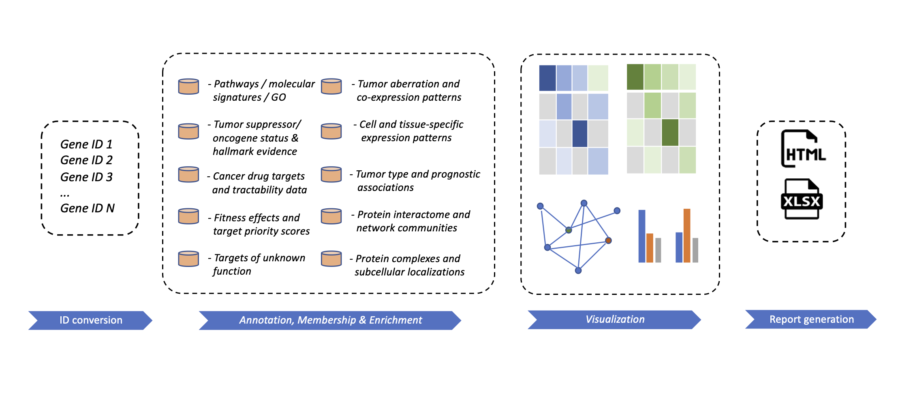
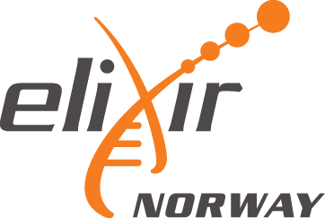

# oncoEnrichR

  

**oncoEnrichR** is an R package for functional interrogation of human
genesets in the context of cancer. It is primarily intended for
exploratory analysis, interpretation, and prioritization of long gene
lists, which represent a common output from many types of
high-throughput cancer biology screens.

**oncoEnrichR** can be used to interrogate results from e.g. genetic
screens (siRNA/CRISPR), protein proximity labeling, or transcriptomics
(differential expression). In principle, oncoEnrichR can be relevant for
any screen or analysis that produces a list of human gene *hits* that
needs functional annotation and/or prioritization with respect to cancer
relevance. The tool queries a number of high-quality data resources in
order to assemble cancer-relevant annotations and analyses in an
interactive report (examples from the report shown below).

Web-based access to **oncoEnrichR** (through the [Galaxy
platform](https://usegalaxy.org/)) is available at
[**https://oncotools.elixir.no**](https://oncotools.elixir.no/tool_runner?tool_id=toolshed.g2.bx.psu.edu%2Frepos%2Fsigven%2Foncoenrichr%2Foncoenrichr_wrapper%2F1.6.2)

**NOTE**: *Web-based access to oncoEnrichR is unfortunately not
operating with the latest release due to Galaxy/Docker issues. Please
use the R package for the latest version of the tool.*

  

  
  

## Questions addressed by oncoEnrichR

The contents of the analysis report provided by oncoEnrichR address the
following scientific questions for a given gene list:

- Which diseases/tumor types are known to be associated with genes in
  the query set, and to what extent?
- Which genes in the query set are known to have oncogenic or tumor
  suppressive roles, using evidence from the biomedical literature and
  curated resources?
- Which genes in the query set are attributed with cancer hallmark
  evidence?
- Which proteins in the query sets are druggable in different cancer
  conditions (early and late clinical development phases)? For other
  proteins in the query set, what is their likelihood of being
  druggable?
- Which protein complexes involve proteins in the query set?
- Which subcellular compartments (nucleus, cytosol, plasma membrane etc)
  are dominant localizations for proteins in the query set?
- Are genes in the query set preferentially expressed in specific human
  tissues or cell types, and which tissues/cell types are significantly
  enriched among the most highly expressed genes in the query set (Human
  Protein Atlas)?
- Which protein-protein interactions are known within the query set? Are
  there interactions between members of the query set and other
  cancer-relevant proteins (e.g. proto-oncogenes, tumor-suppressors or
  predicted cancer drivers)? Which proteins constitute hubs in the
  protein-protein interaction network?
- Which known regulatory interactions (TF-target) are found within the
  query set, and what is their mode of regulation (repressive vs.
  stimulating)?
- Are there occurrences of known ligand-receptor interactions within the
  query set?
- Are there specific pathways, biological processes, or pre-defined
  molecular signatures that are enriched within the query set, as
  compared to a reference/background set?
- Which members of the query set are frequently mutated in tumor sample
  cohorts (TCGA, SNVs/InDels, homozygous deletions, copy number
  amplifications)?
- Which members of the query set are co-expressed (strong negative or
  positive correlations) with cancer-relevant genes (i.e.
  proto-oncogenes or tumor suppressors) in tumor sample cohorts (TCGA)?
- Which members of the query set are associated with better/worse
  survival in different cancers, considering high or low gene expression
  levels, mutation, or copy number status in tumors?
- Which members of the query set are predicted as partners of synthetic
  lethality interactions?
- Which members of the query set are associated with cellular
  loss-of-fitness in CRISPR/Cas9 whole-genome drop out screens of cancer
  cell lines (i.e. reduction of cell viability elicited by a gene
  inactivation)? Which targets are prioritized therapeutic targets,
  considering fitness effects and genomic biomarkers in combination?

See also the [output
views](https://sigven.github.io/oncoEnrichR/articles/output.md) that
addresses each of the questions above.

## News

- August 6th 2026: [**1.6.2
  release**](https://sigven.github.io/oncoEnrichR/articles/CHANGELOG.html#version-1-6-2)
- December 17th 2025: [**1.6.1
  release**](https://sigven.github.io/oncoEnrichR/articles/CHANGELOG.html#version-1-6-1)
- September 19th 2025: [**1.6.0
  release**](https://sigven.github.io/oncoEnrichR/articles/CHANGELOG.html#version-1-6-0)
- February 27th 2025: [**1.5.3
  release**](https://sigven.github.io/oncoEnrichR/articles/CHANGELOG.html#version-1-5-3)
- September 9th 2024: [**1.5.2
  release**](https://sigven.github.io/oncoEnrichR/articles/CHANGELOG.html#version-1-5-2)

## Citation

If you use oncoEnrichR, please cite the following publication:

Sigve Nakken, Sveinung Gundersen, Fabian L. M. Bernal, Dimitris
Polychronopoulos, Eivind Hovig, and Jørgen Wesche. **Comprehensive
interrogation of gene lists from genome-scale cancer screens with
oncoEnrichR** (2023). Int J Cancer.
[doi:10.1002/ijc.34666](https://doi.org/10.1002/ijc.34666)

## Example report

  

## Getting started

- [Installation
  instructions](https://sigven.github.io/oncoEnrichR/articles/installation.md)
- [How to run
  oncoEnrichR](https://sigven.github.io/oncoEnrichR/articles/running.md)
- [Explore the various analysis outputs produced with
  oncoEnrichR](https://sigven.github.io/oncoEnrichR/articles/output.md)
- [Annotation resources available in
  oncoEnrichR](https://sigven.github.io/oncoEnrichR/articles/annotation_resources.md)

## Contact

sigven AT ifi.uio.no

## Funding and Collaboration

oncoEnrichR is supported by the [Centre for Cancer Cell
Reprogramming](https://www.med.uio.no/cancell/english/) at the
[University of Oslo](https://www.uio.no)/[Oslo University
Hospital](https://radium.no), and [Elixir Norway (Oslo
node)](https://elixir.no/organization/organisation/elixir-uio).

  
  

      

