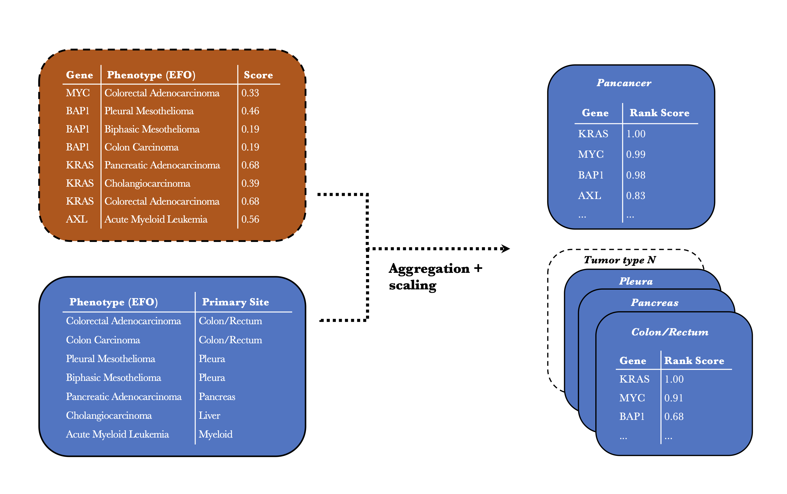

Direct associations between human genes and phenotypes/diseases were retrieved from the Open Targets Platform (OTP, v2022.11, https://platform.opentargets.org/downloads/data). Here, associations are quantified as numerical scores in the range 0-1, with larger values indicating a stronger association between the gene and the phenotype (https://platform-docs.opentargets.org/associations#overall). Phenotypes from OTP were provided as Experimental Factor Ontology (EFO) terms. For each OTP association, we integrated the underlying data type evidence, examples being genetic associations, text mining, pathway associations, or animal models. Next, in order to focus on the subset of associations with strongest confidence in underlying evidence, we considered only associations with support from at least two data types, and with an overall association score >= 0.05. Finally, in order to limit associations to cancer phenotypes, we set up a curated mapping between EFO terms and n = 32 primary tumor types/sites, using OncoTree as a starting point (the complete mapping is available at https://github.com/sigven/phenOncoX). This produced a final list of n = 33,369 associations between genes and cancer phenotype terms. 

In order to establish an overall ranking of genes with respect to cancer relevance, we summarized, for each tumor type/site, the potential multiple OTP association scores found per gene, and computed a scaled rank between 0 and 1 (i.e. gene-tumor type rank). Next, we computed a global (i.e. pancancer) gene-cancer rank per gene by summarizing the gene-tumor type rank found across tumor types, with all genes ultimately ranked and scaled between 0 and 1 (illustration below).

 

  

 

